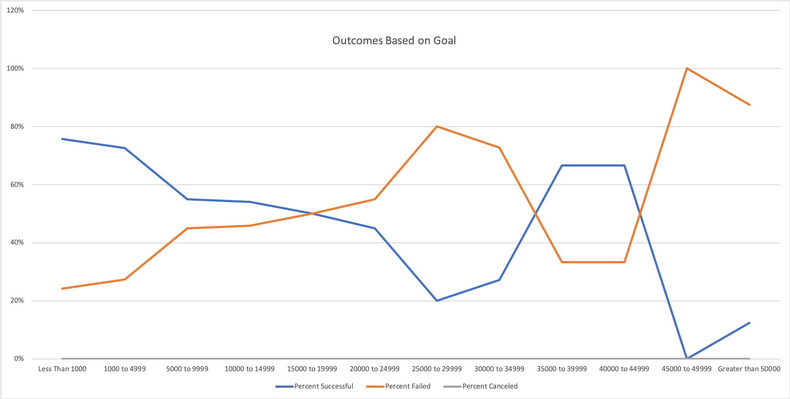

# Kickstarting with Excel

## Overview of Project

### Purpose
In this project, I was tasked with helping a playwright, Louise, start a crowdfunding campaign to fund her upcoming play, "Fever". To do so, I have analyzed a large set of crowdfunding data to uncover patterns, and will use my findings to help Louise achieve her goal of raising $10,000. 

## Analysis and Challenges

### Analysis of Outcomes Based on Launch Date
To perform this analysis, I first created a pivot table that displayed the outcomes of crowdfunding campaigns based on the month in which they launched. To get more specific, I filtered the table to only display campaigns of the "theater" parent category. I also sorted the data by whether the campaign was successful, failed, or was canceled. The resulting data can be used to determine the time of year Louise's crowdfunding efforts are more likely to succeed. The results are shown below.

### Analysis of Outcomes Based on Goals
While the success rates of crowdfunding at different times of the year are important in determining when Louise should kickstart her fundraising efforts, other factors must be taken into account, such as the amounts of the fundraising goals. Honing in on the subcategory of "plays" to get the data as specific and relevant as possible, I created a data table summarizing the number and percentage of successful, failed, and canceled crowdfunding efforts, categorized by goal ranges. This analysis is necessary to determine the feasibility of Louise's $10,000 fundraising goal. The findings are shown below.

### Challenges and Difficulties Encountered
During my analysis of the Kickstarter data, I did not encounter any major challenges or difficulties. However, I found that using COUNTIF() function in order to gather the data for the "Outcomes Based on Goal" chart was rather complicated. Because the data was being filtered on several different criteria, such as subcategory, goal amount, and outcome, the formulas were lengthy and I struggled to keep track of them and make sure they were all correct. A lot of the aspects of this sheet, both the data and formulas, had to be entered manually, which in general makes the process more difficult to manage. Besides this table, I had a relatively seamless experience performing the Kickstarter analysis, partially due to the fact that I have a lot of experience working with Excel, specifically in making pivot tables.

## Results

### Conclusion on Outcomes based on Launch Date
After analyzing the outcomes of crowdfunding efforts based on launch date, it is clear that theater campaigns show the most successes around May and June. It must be noted that failures are also the highest around this time of year, due to the fact that the total number of crowdfunding efforts occur during this time. However, the spike in successes is more significant than the slight increase in failures, so I would definitely recomnmend Louise launch her crowdfunding campaign in either May or June. Additionally, it is important to recognize that at all times of the year, there are more successes than failures in the theater category.

### Conclusion on Outcomes based on Goals
After analyzing the outcomes based on goal amount and viewing the resulting chart, it appears there is not a consistent correlation between goal amount and outcome for the "plays" subcategory. Honing in on Louise's goal amount of $10,000, the data shows that she would have a little more than 50% chance of success. However, this chart does not take into account the launch date, or by how much the failed efforts missed their goal. It is hard to make a solid recommendation to Louise using this chart alone, but the insights will help her in gaining an idea of whether or not her crowdfunding will be a success.

### Limitations of the Dataset and Other Possible Tables/Graphs
While the Kickstarter dataset was extremely large, there were still several limitations in our analysis. To better this analysis and gain more insight, we could make a table or graph that takes into account both the launch date and goal amount for crowdfunding, specifically for plays. This would provide a link between the goal amount and the time of year, and would probably give more clarity as to whether or not Louise will be successful in her crowdfunding efforts. As mentioned previously, the 56% success rate for projects of Louise's goal range may differ each month, and could potentially be higher in May or June. Additionally, because Louise is interested in both the markets in the US and in Great Britain, we could create a chart comparing the chance of success in both countries. This could give more insight into which country she should launch her crowdfunding efforts in, if her play is more likely to be successful in one than the other. Also, while we focused on the monthly differences in crowdfunding outcomes, we failed to account for the yearly changes. A chart showing the yearly trends in both the theater parent category and plays subcategory could provide more insight into how Louise should go about launching the crowdfunding efforts for her play. Lastly, the duration of the campaign (the time from when it began to when it ended) is a crucial detail that was not accounted for in our analysis. Some goals were achieved more quickly than others, and some campaigns may have ended before the goal had the chance to be reached. A chart displaying crowdfunding length in relation to outcome could provide Louise with insight on how long she should attempt to raise money for.

