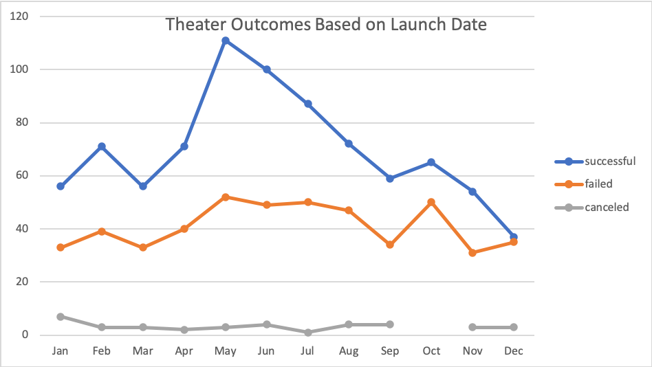

# Kickstarting with Excel

## Overview of Project

### Purpose
In this project, I was tasked with helping a playwright, Louise, start a crowdfunding campaign to fund her upcoming play, "Fever". To do so, I have analyzed a large set of crowdfunding data to uncover patterns, and will use my findings to help Louise achieve her goal of raising $10,000. 

## Analysis and Challenges

### Analysis of Outcomes Based on Launch Date
To perform this analysis, I first created a pivot table that displayed the outcomes of crowdfunding campaigns based on the month in which they launched. To get more specific, I filtered the table to only display campaigns of the "theater" parent category. I also sorted the data by whether the campaign was successful, failed, or was canceled. The resulting data can be used to determine the time of year Louise's crowdfunding efforts are more likely to succeed. The results are shown below.

### Analysis of Outcomes Based on Goals
While the success rates of crowdfunding at different times of the year are important in determining when Louise should kickstart her fundraising efforts, other factors must be taken into account, such as the amounts of the fundraising goals. Honing in on the subcategory of "plays" to get the data as specific and relevant as possible, I created a data table summarizing the number and percentage of successful, failed, and canceled crowdfunding efforts, categorized by goal ranges. This analysis is necessary to determine the feasibility of Louise's $10,000 fundraising goal. The findings are shown below.

### Challenges and Difficulties Encountered

## Results

- What are two conclusions you can draw about the Outcomes based on Launch Date?

- What can you conclude about the Outcomes based on Goals?

- What are some limitations of this dataset?

- What are some other possible tables and/or graphs that we could create?
